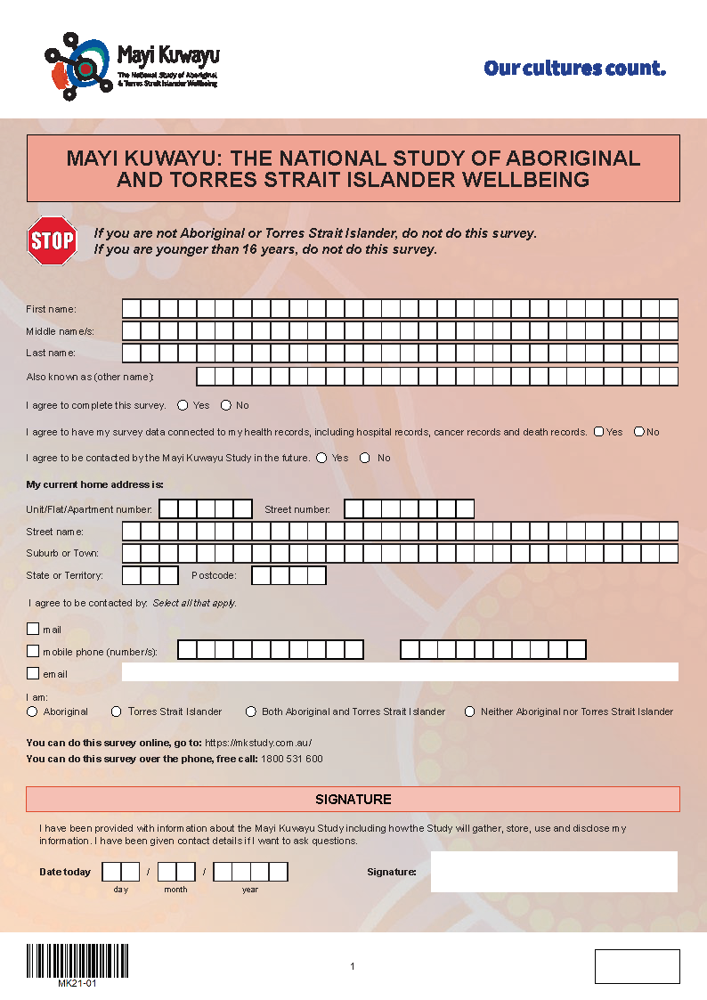

## Acknowledgement {background-image="img/star.png" background-repeat="no-repeat" background-opacity=0.015}

## Mayi Kuwayu Study {background-image="img/star.png" background-repeat="no-repeat" background-opacity=0.015}

::: {.columns}

:::: {.column width=48%}

{width=70%}

::::

:::: {.column width=4%}
::::

:::: {.column .incremental width=48%}

-   Indigenous Data Sovereignty and Governance
-   First wave beginning in 2018
-   Living cohort
-   Over 16,000 responses to date
-   Majority paper-based

::::

:::

## Data cleaning as perpetual stew {background-image="img/star.png" background-repeat="no-repeat" background-opacity=0.015}

::: {.columns}

:::: {.column width=48%}

::::

:::: {.column width=4%}
::::

:::: {.column .incremental width=48%}
A **very common** method of data cleaning:

-   One (very busy) person
-   A mix of R scripts and spreadsheets
-   Multiple versions of these files
-   Minimal documentation
-   Required author knowledge in order to run from start to finish
::::

:::

## Making a new meal {background-image="img/star.png" background-repeat="no-repeat" background-opacity=0.015}

::: {.columns}

:::: {.column width=48%}

::::

:::: {.column width=4%}
::::

:::: {.column .incremental width=48%}
A rare opportunity to re-do everything — storage, cleaning, documentation

-   Keeping existing processes/elements that were working
-   Ideally very similar output
-   Incorporate long-term requirements
    -   Data linkage
    -   Improved participant management
    -   Data quality reporting
    -   **Continuously updated datasets**
::::

:::

::: {.notes}
I knew exactly what I thought the data cleaning process should look like but I was also mindful that I'd only been in the team for a couple of months, so I didn't want to be that person that comes in and rocks the boat too much.

There's more work to do than people realistically have time for, so a lot of the existing processes were borne out of just making things work, at the time, with what we had.

I'm also mindful to not railroad people into doing what I want, so I did also spend time with everyone involved at different steps of the data lifecycle to find out what they did and what gripes there were, to see what I could help make easier.
:::

## Making a new meal {background-image="img/star.png" background-repeat="no-repeat" background-opacity=0.015}

::: {.columns}

:::: {.column width=48%}

::::

:::: {.column width=4%}
::::

:::: {.column .incremental width=48%}
The human context:

-   Majority non-R team
    -   Main exposure was the cleaning code
    -   Too busy* to learn R
-   Existing processes that mostly* work
    -   Spreadsheets for certain processes
    -   Usable data
-   Only one of me
::::

:::

::: {.notes}
The primary experience in the team was that R was hard to read/do, so why would they want the rework in R again? Required a good use-case as well as trust.

To some degree, people are too busy because they don't want to make time for something. Being open and persistent in demonstrating why R (and Quarto) were great has led to a huge turnaround in attitude toward it.

Trust was built on a mix of being being open, personable, and aggressively transparent

-   Making people listen to me about what I was doing and why
    -   Not always appreciated or immediately useful, but I hope that in the long-term, the more people who have some idea of what's going on, the more likely I'll get input from end-users
    -   Also, repeated exposure to something makes you more likely to like it, right?
:::

## What was I going to cook? {background-image="img/star.png" background-repeat="no-repeat" background-opacity=0.015}

::: {.columns}

:::: {.column width=48%}

::::

:::: {.column width=4%}
::::

:::: {.column .incremental width=48%}
I proposed a rework of the cleaning process to use:

-   REDCap/APIs instead of spreadsheets
-   `renv` to manage package versions/dependencies
-   `targets` to track the whole pipeline
-   `tidyverse` because... `tidyverse`
-   `testthat` and `pointblank` for testing and validation
-   `git` for version control
::::

:::

::: {.notes}
From being in a community of practice (runapp, bluesky), I was familiar with what was 'best practice' so aimed to do that.

For those of you in the room, this might not seem like anything out of the ordinary, but for the team this was a significant departure from the current practice and what they were familiar with.
:::

## Testing out the recipe {background-image="img/star.png" background-repeat="no-repeat" background-opacity=0.015}

::: {.columns}

:::: {.column width=48%}

{width=50%}

::::

:::: {.column width=4%}
::::

:::: {.column .incremental width=48%}
Multi-purpose code reviews:

-   Expert review
    -   Integrity
    -   New ideas
-   Novice review
    -   Readability
    -   Teaching opportunity
-   Team review
    -   Bringing people along
    -   Blowing minds (mine too)
::::

:::

::: {.notes}
One of the great things about my team is that code reviews and checks are the norm, so hiring external expertise to do the code review was not a problem.

Having someone with no prior R experience sit down and go through the code was a great way to see areas that were difficult to understand or poorly written — and told me where things needed more or better comments, or more detailed explanation in the documentation

We have a fortnightly data team meeting which I've been using to review one script file at a time. This has been a great way to:

-   repeatedly expose people to R code
-   show people what's going on
-   get feedback from data users
-   create video documentation!!
:::

## What was I going to cook? {background-image="img/star.png" background-repeat="no-repeat" background-opacity=0.015}

::: {.columns}

:::: {.column width=48%}

::::

:::: {.column width=4%}
::::

:::: {.column width=48%}
I proposed a rework of the cleaning process to use:

-   REDCap/APIs instead of spreadsheets
-   `renv` to manage package versions/dependencies
-   ~~`targets` to track the whole pipeline~~
-   `tidyverse` because... `tidyverse`
-   ~~`testthat` and `pointblank` for testing and validation~~
-   `git` for version control
::::

:::

::: {.notes}
Switching from Stata to R/tidyverse is a significant transition in itself. My goal was to build something that others could maintain — didn't seem like a great idea to introduce too many packages and ways of working that **I** was having to learn as I was implementing.

As capacity in the team increases we'll hopefully be able to incorporate these missing parts.
:::## Now we're cooking! {background-image="img/star.png" background-repeat="no-repeat" background-opacity=0.015}

::: {.incremental}
Closing thoughts:

-   `install.packages("trust")`
-   Code is only reproducible so long as it's maintainable (sorry, `targets`)
-   Changing minds takes time and enthusiasm
-   Transparency and openness to changing my own plans
:::

## {background-image="img/star.png" background-repeat="no-repeat" background-opacity=0.015}

## Stuff I thought was really cool

-   Cycle of cleaning -> audit -> cleaning
-   `httr2`
-   Converging to a pseudo-`targets` setup
-   The naming convention I proposed
-   Missing data