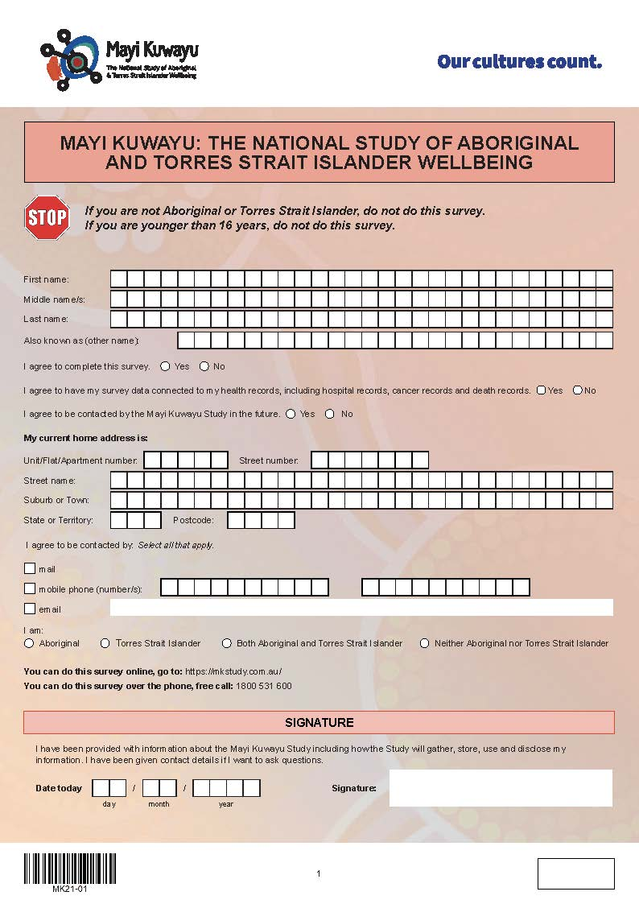
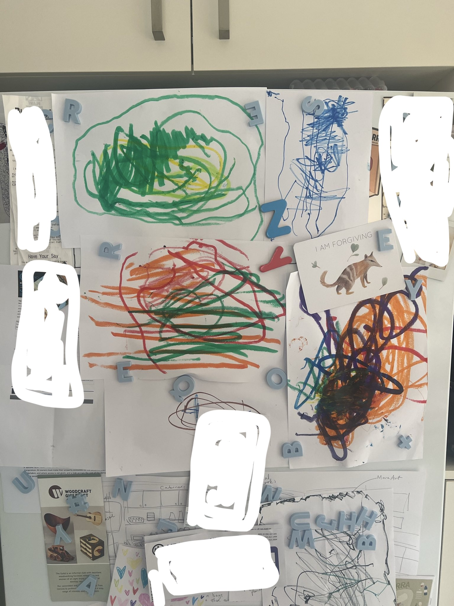
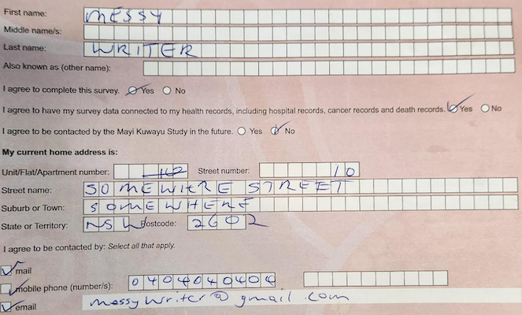
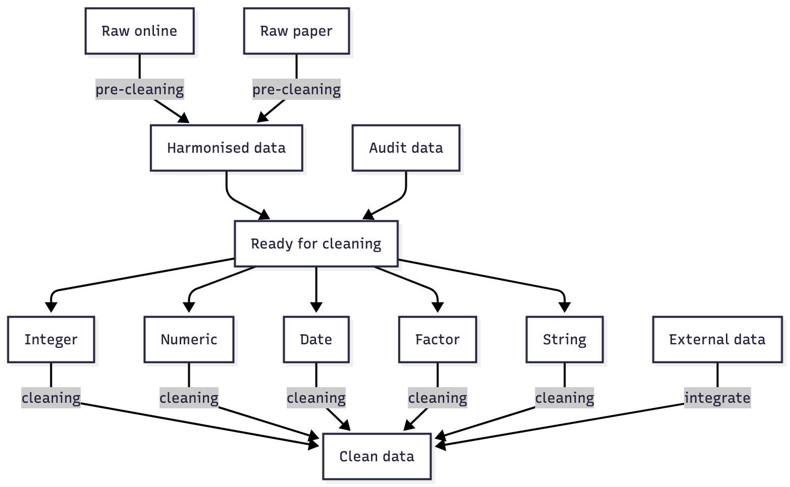

```{r}
#| echo: false
library(tidyverse)
library(gt)
```


# Acknowledgement

## About me

Doing data things since 2017:

-   Randomised trials
-   Observational studies
-   Longitudinal surveys
-   Administrative data
-   Data linkage

Currently work at Yardhura Walani on the Mayi Kuwayu Study

## Mayi Kuwayu

The largest national study of Aboriginal and Torres Strait Islander culture, health, and wellbeing.

-   ~12,000 responses to Wave 1
-   Currently at the tail-end of Wave 2
-   Questionnaire provided in paper and online formats
-   Indigenous Data Sovereignty and Governance
-   Won the NHMRC David Cooper Clinical Trials and Cohort Studies Award

# Getting data

> Daddy, where do data come from?

## The birds and the bees

Several consenting adults get together and decide to make a...

::: {.notes}
Gloss over design phase
:::

## The birds and the bees

Several consenting adults get together and decide to make a...

{height=800px}

## Baby's first steps {}

::: {.incremental}

-   They're very tall for their age
    - (it's too long)
-   What an *interesting* outfit
    - (the design has issues)
-   They're gorgeous
    - (perfect, good to go)
-   It looks just like you
    - ???

:::

::: {.notes}
Pilot phase
:::

## Time to collect data

::: {.columns}
:::: {.column .incremental}
-   Physical mail
    -   Initially a sample of Medicare database
    -   Here's a copy for a friend!
-   Electronic mail
    -   Past participants
    -   Newsletters

::::
:::: {.column .incremental}
-   Social media
-   Conferences
-   Community engagement
    -   Partners
    -   Roadshow

::::
:::

## Paper responses

::: {.columns}
:::: {.column}
::::: {.fragment}
The first one arrives, up it goes
:::::
::::: {.fragment}
More appear, yay!
:::::
::::: {.fragment}
Wow when is it going to stop
:::::
::::: {.fragment}
Much like drawings on the fridge, every one is precious
:::::
::::: {.fragment}
Unlike those drawings, every response is retained and stored somewhere
:::::
::::
:::: {.column}
{height=800px}
::::
:::

# Please hold while data is being entered

## Online responses
::: {.columns}
:::: {.column}

::::: {.fragment .incremental}
We need a platform that does

-   Questionnaire design
-   Survey administration
-   Data management
:::::

::::: {.fragment .incremental}
Online distribution changes things

-   More control (better data) 🙂
-   No data entry time (less work) 😀
-   Easier to stop (less data) 😕
:::::
::::
:::: {.column}
{height=300px}
::::
:::

# Please hold while data is being entered

::: {.notes}
Ping of 51ms
:::

# Digitising data

> Daddy, how do you turn the paper questionnaires into numbers on the screen

## Computer has a go

<!-- Scanning process -->
::: {.columns}
:::: {.column .incremental}
-   Checkboxes
    -   ✅
-   Radios
    -   ✅✅
-   Handwriting
    -   åååååååååååååååååååååå

::::
:::: {.column}

::::
:::

## Human has a go

<!-- Verification process -->
::: {.columns}
:::: {.column .incremental}
-   Check the computer's work
    -   Fix mistakes
    -   Enter hand-written text
-   Approx 10min per questionnaire
    -   6 per hour
    -   20 per day (breaks required!)
    -   100 per week...
    -   That's a lot of people hours!

::::
:::: {.column}
<!-- Someone getting progressively more tired -->
::::
:::

## Human has another go

<!-- Audit process -->
::: {.columns}
:::: {.column .incremental}
-   Data auditing
    -   Failure of a validation rules
    -   Unmatched addresses
-   Refer back to scanned questionnaire (!!)
    -   Provide updated value

::::
:::: {.column}

::::
:::


## Nobody has a go

# Cleaning data

> Daddy, can we give the data a bath tonight?

## It's this simple

{width=1000px}

## Start reading early

::: {.columns}
:::: {.column width=30%}
The data dictionary is essential for cleaning and documentation:

::::: {.incremental}
-   Splitting by type
-   Automating validation
-   Labelling values and variables
:::::

::::: {.fragment}
Use the dictionary instead of hardcoding values!
:::::

::::
:::: {.column width=5%}
::::
:::: {.column width=65%}
```{r}
#| echo: false
dictionary <- tibble(
  variable = c("id","age","dob","employment"),
  label = c("Participant ID", "Age in years", "Date of birth", "Employment status"),
  type = c("string","numeric","date","radio"),
  options = c("","","","1, Full-time<br/>2, Part-time<br/>3, Casual<br/>4, Retired"),
  min = c("","16","1900-01-01","1"),
  max = c("","130","2006-01-01","4")
)

gt(dictionary) |>
  cols_align(align = "left") |> 
  opt_table_font(
    size = "20px"
  ) |> 
  fmt_markdown()
```

```{r}
#| eval: false
#| code-fold: true
#| code-summary: "Example"
#| code-overflow: scroll
across(
  .cols = any_of(dictionary |> filter(type %in% c("numeric", "integer")) |> pull(variable)),
  .fns = \(x) {
    min <- dictionary |> filter(variable == cur_column()) |> pull(minimum) |> as.numeric()
    max <- dictionary |> filter(variable == cur_column()) |> pull(maximum) |> as.numeric()
    if_else(
      condition = between(as.numeric(x), min, max),
      true = x,
      false = "-777777",
      missing = NA
    )
  }
```
::::
:::

## 



## 5 minutes until bath time!

::: {.columns}
:::: {.column .incremental}
1.  Read in data
2.  Harmonise the data
    -   Check variable names
    -   Apply consistent coding
3.  Apply exclusions
    -   Repeat entries
    -   Empty responses
4.  Incorporate audits
5.  Get cleaning

::::
:::: {.column}
::::: {.fragment}
{height=800}
:::::
::::
:::

## Can you count to 010?

::: {.fragment}
```{r}
#| eval: false
#| code-fold: true
#| code-summary: "Tidy up whitespace"
str_remove_all(
  string = response,
  pattern = "[:space:]"
)
```
:::
::: {.fragment}
```{r}
#| eval: false
#| code-fold: true
#| code-summary: "Remove audit text"
str_detect(
  string = response,
  pattern = "\\{.+\\}"
)
```
:::
::: {.fragment}
```{r}
#| eval: false
#| code-fold: true
#| code-summary: "Check for non-digits"
str_detect(
  string = response,
  pattern = "[^-|\\d+|\\.]+"
)
```
:::
::: {.fragment}
```{r}
#| eval: false
#| code-fold: true
#| code-summary: "Check for digits"
str_detect(
  string = response,
  pattern = "\\d"
)
```
:::
::: {.fragment}
```{r}
#| eval: false
#| code-fold: true
#| code-summary: "Check for decimals"
str_detect(
  string = response,
  pattern = "\\."
)

as.character(round_half_up(as.numeric(response)))
```
:::
::: {.fragment}
```{r}
#| eval: false
#| code-fold: true
#| code-summary: "Does it parse as int/num?"
is.na(as.integer(response))
```
:::

## My favourite month is...

::: {.columns}
:::: {.column}
::::: {.fragment}
```{r}
#| eval: false
#| code-fold: true
#| code-summary: "Did the scanner struggle?"
str_detect(
  string = response,
  pattern = "\\^"
)
```
:::::
::::: {.fragment}
```{r}
#| eval: false
#| code-fold: true
#| code-summary: "Check for non-digits"
str_detect(
  string = response,
  pattern = "[^[:digit:]-]"
)
```
:::::
::::: {.fragment}
```{r}
#| eval: false
#| code-fold: true
#| code-summary: "Check for separators"
str_detect(
  string = response,
  pattern = "-"
)
```
:::::
::::
:::: {.column}
::::: {.fragment}
```{r}
#| eval: false
#| code-fold: true
#| code-summary: "Check the value of each element"
map_dbl(
  .x = response,
  .f = \(x) {
    min(
      get_numbers_from_string(
        string = x,
        separating_pattern = "-"
      )
    )
  }
)
```
:::::
::::: {.fragment}
```{r}
#| eval: false
#| code-fold: true
#| code-summary: "Check for ambiguous dates"
is_valid_date_format(
        variable = response,
        format = "%d-%m",
        exact = TRUE
      ) &
        # month-year not missing
        is_valid_date_format(
          variable = response,
          format = c("%m-%y", "%m-%Y"),
          exact = TRUE
        )
```
:::::
::::: {.fragment}
```{r}
#| eval: false
#| code-fold: true
#| code-summary: "Check for missing days"
is_valid_date_format(
        variable = validate_unambiguous_date,
        format = c("%m-%y", "%m-%Y"),
        exact = TRUE
      )
```
:::::
::::
:::

## Can you write your name?

::::: {.fragment}
```{r}
#| eval: false
#| code-fold: true
#| code-summary: "Standardise strings"
str_to_lower(condense_whitespace(response))
```
:::::
::::: {.fragment}
```{r}
#| eval: false
#| code-fold: true
#| code-summary: "Check for empty strings"
str_remove_all(
  string = response,
  pattern = "[:space:]"
) == ""
```
:::::
::::: {.fragment}
```{r}
#| eval: false
#| code-fold: true
#| code-summary: "Did the scanner struggle?"
str_remove_all(
  string = response,
  pattern = "[:space:]"
) == ""
```
:::::
::::: {.fragment}
```{r}
#| eval: false
#| code-fold: true
#| code-summary: "Did the scanner hallucinate?"
str_detect(
  string = response,
  pattern = "speech or language impairment"
)
```
:::::
::::: {.fragment}
```{r}
#| eval: false
#| code-fold: true
#| code-summary: "Did the scanner hallucinate?"
str_detect(
  string = response,
  pattern = "[:alnum:]"
)
```
:::::
::::: {.fragment}
```{r}
#| eval: false
#| code-fold: true
#| code-summary: "Check for unusual characters"
str_detect(
        string = response,
        pattern = '[^\\w\\d\\s\\!\\?\\-\\(\\)\\[\\]\'"\\.,;:/@#&$+%=><*~\\|]'
      )
```
:::::
::::: {.fragment}
```{r}
#| eval: false
#| code-fold: true
#| code-summary: "Check specific formatting"
variable == "email" & is_email(response)
variable == "postcode" & nchar(response) != 4
variable == "phone" & !(nchar(response) %in% c(8, 10, 11))
```
:::::

## Playing with friends

::: {.columns}
:::: {.column .incremental}
::::: {.fragment}
Deriving from existing data

-   Back page text
    -   Transcription and coding
-   Survey weights
-   Standardised variables
    -   Commonly used demographics
    -   Validated measures

:::::
::::
:::: {.column .incremental}
::::: {.fragment}
Incorporating external data

-   Address/geography
    -   [G-NAF/Geoscape](https://geoscape.com.au/) via API
    -   ABS data products
    -   Check for pre-existing matched addresses
-   (Internal) data linkage
    -   Within- and across- wave responders
    -   Across studies
    -   Unique identifier

:::::
::::
:::

## Nearly time for bed

::: {.incremental}
-   Encode missingness
    -   See [blog post](https://benharrap.com/post/2025-07-14-to-col-or-not-to-col/)
-   Convert to appropriate data type
-   Final validation
-   Variable naming
    -   See [blog post](https://benharrap.com/post/2025-03-03-variable-naming-convention/)
-   Labelling
-   Deidentification

:::

# Data about data

> Daddy, have you thought about using metadata to inform the questionnaire redesign process?

## Missingness

```{r}
#| echo: false
set.seed(4)

miss <- tibble(
  id = c(1, 2, 3, 4, 5),
  name_first = c("Tom", "Penny", "Trevor", "Ursula", "Jenny"),
  name_last = c("Smith", "Jones", "", "Smith", "Jones"),
  age = c(62, 52, 37, 44, ""),
  x1 = runif(5, 0, 2),
  x2 = runif(5, 0, 2),
  x3 = runif(5, 0, 2),
  x_text = c("Lorem", "", "", "Lorem", ""),
  y1 = runif(5, 0, 2),
  y2 = runif(5, 0, 2),
  y3 = runif(5, 0, 2),
  z1 = runif(5, 0, 2),
  z2 = runif(5, 0, 2),
  z3 = runif(5, 0, 2)
) |>
  mutate(
    across(matches("\\d"), \(x) if_else(x > 1, "", as.character(round(x)))),
    across(everything(), as.character)
  ) |> 
  gt() |> 
  tab_options(
    table.font.size = pct(100)
  ) |> 
  tab_style(
    style = cell_borders(
      sides = c("top", "bottom"),
      weight = px(1.5),
      style = "solid"
    ),
    locations = list(cells_body(), cells_column_labels())
  ) |> 
  tab_style(
    style = cell_borders(
      sides = c("left"),
      weight = px(1.5),
      style = "solid"
    ),
    locations = cells_body(
      c(name_first, age, x1, y1, z1)
    )
  ) |> 
  opt_horizontal_padding(scale = 3)
```

::: {.r-stack}

:::: {.fragment .fade-in-and-out}
```{r}
#| echo: false
miss
```
::::
:::: {.fragment .fade-in-and-out}
```{r}
#| echo: false
miss |> 
  tab_style(
    style = cell_fill(color = "#f134a5"),
    locations = cells_body(
      columns = c(x1,x3,y2,y3),
      rows = id == 1
      )
  )
```

::::
:::: {.fragment .fade-in-and-out}
```{r}
#| echo: false
miss |> 
  tab_style(
    style = cell_fill(color = "#f134a5"),
    locations = cells_body(
      columns = c(y1,y2,y3),
      rows = id == 5
      )
  )
```

::::
:::: {.fragment .fade-in-and-out}
```{r}
#| echo: false
miss |> 
  tab_style(
    style = cell_fill(color = "#f134a5"),
    locations = cells_body(
      columns = c(y1,y2,y3,z1,z2,z3),
      rows = id == 3
      )
  )
```

::::
:::

## Who what where why when

::: {.columns}
:::: {.column .incremental}
::::: {.fragment}
Check invalid responses

-   Wording
-   Response options
-   Context
-   Layout
-   Scanner

:::::
::::
:::: {.column .incremental}
::::: {.fragment}
Check valid responses

-   Missingness
-   Response options
-   Question topic
-   Question number

:::::
::::
:::

# Time for bed

## Time for bed

::: {.columns}
:::: {.column}

-   Big job
-   Get the data dictionary sorted first
    -   Write generalisable code
-   Look at the data
    -   Write tests
    
::::
:::: {.column}
Slide setup

[github.com/benharrap/workshops](github.com/benharrap/workshops)

Say hi

[benjamin.harrap@anu.edu.au](mailto:benjamin.harrap@anu.edu.au)

[bsky.app/profile/bharrap.bsky.social](bsky.app/profile/bharrap.bsky.social)

[benharrap.com](benharrap.com)
::::
:::