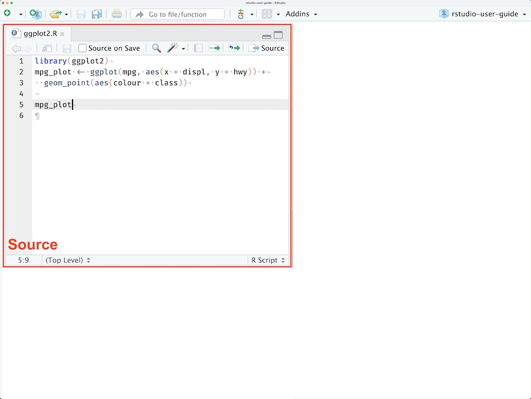
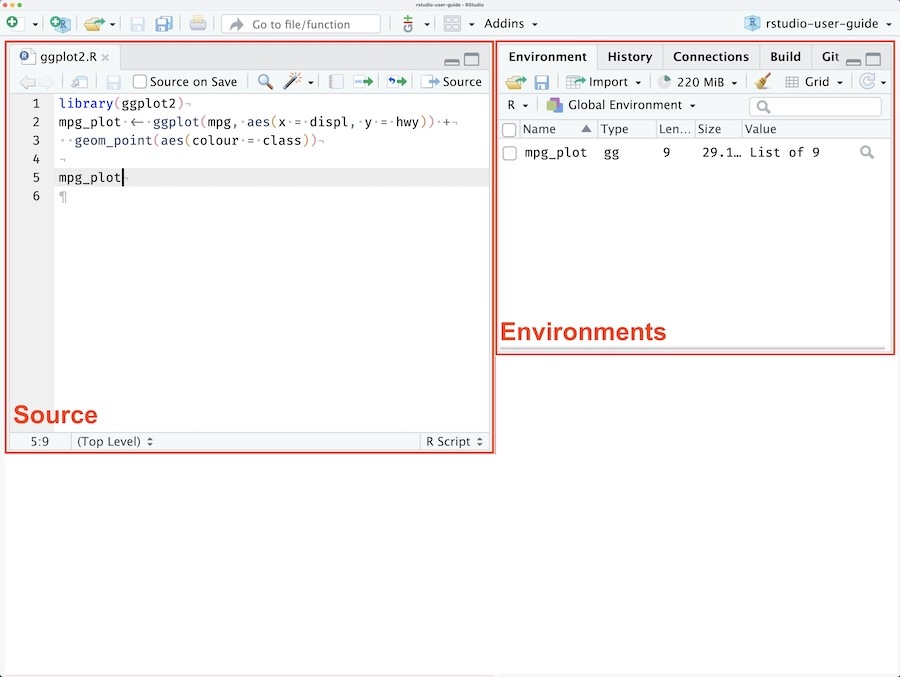
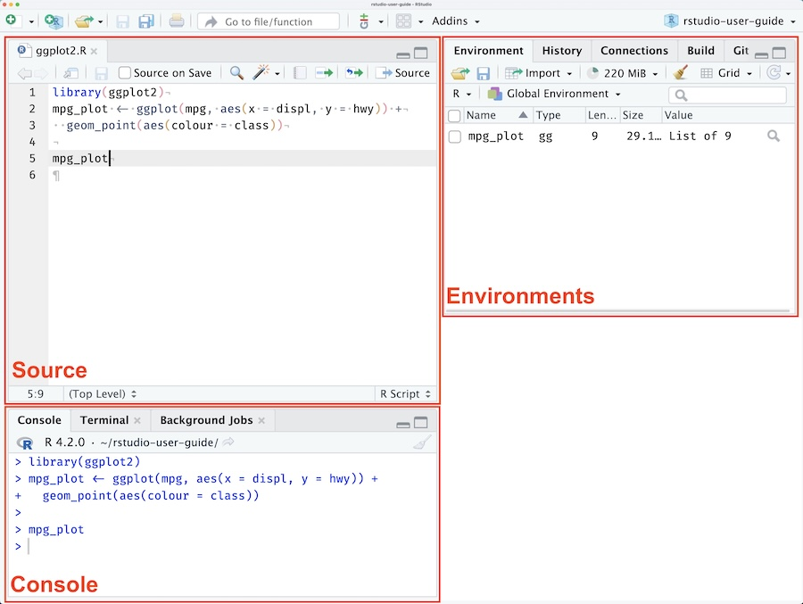
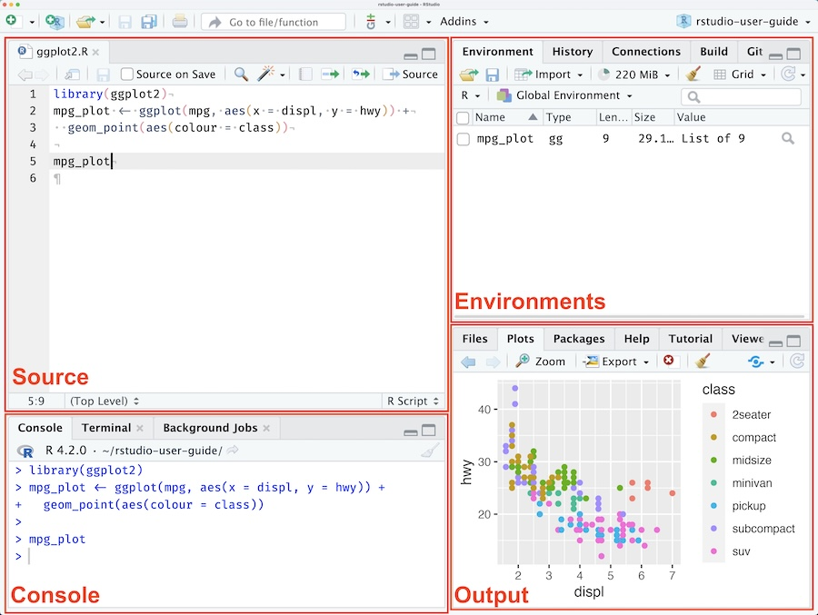
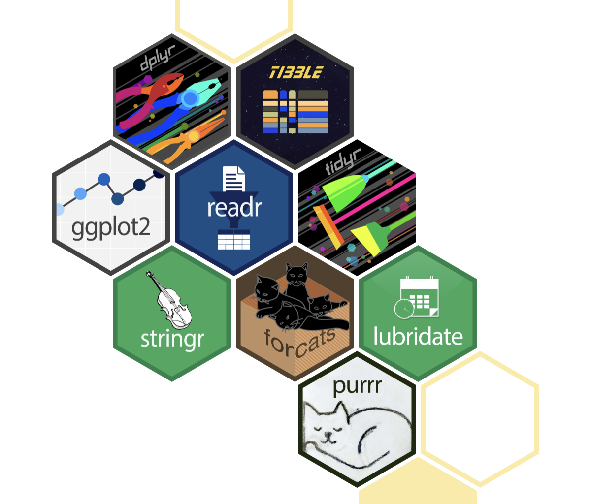
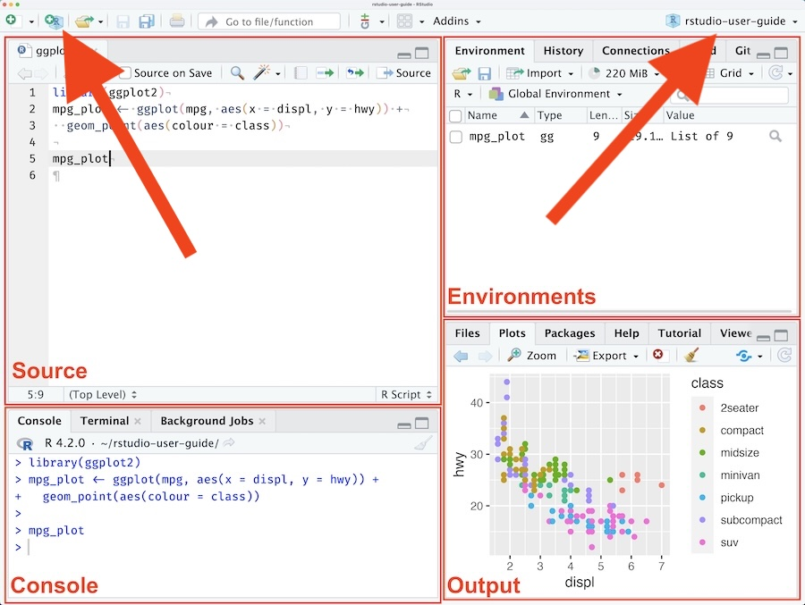
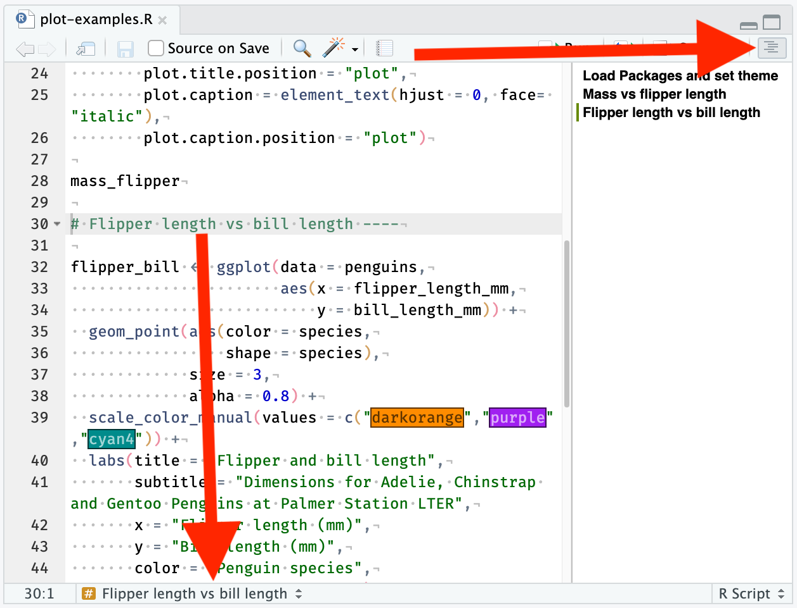

```{r}
#| echo: false
library(countdown)
countdown_style(
  box_shadow = "0px 0px 0px 0px #FFFFFF",
  color_background = "#FFFFFF",
  color_running_background = "#FFFFFF",
  color_running_border = "#FFFFFF",
  color_finished_background = "#FFFFFF",
  color_finished_border = "#FFFFFF",
  color_border = "#FFFFFF",
  font_size = "3em"
)
```


# Hello

## Hello

:::: {.columns}
::: {.column width=45%}
-   I do stuff with data
    - Developing measures, designing questionnaires
    - Collection, storage, cleaning & validation, linkage
    - User management, access, dataset release
    - Statistical analysis, visualisation
-   Biostatistician, survey statistician, data scientist, data engineer
-   Started out using Stata, now use R

:::
::: {.column width=10%}
:::
::: {.column width=45%}

insert picture of me

:::
::::

## What's the plan?

:::: {.columns}
::: {.column width=45%}
-   Getting setup (XXmin)
    -   RStudio interface
    -   Packages
    -   Projects and folders

-   Coding in R
    -   Key concepts
    -   Data types
    -   Good practices
    -   Error messages
    
:::
::: {.column width=45%}
-   Data wrangling
    -   Common transformations
    -   

-   Data visualisation
    -   `ggplot2`

-   Modelling (XXmin)
    -   Important notes
    -   Fitting a model
    -   Getting results

:::
::::

## What you'll come away with

:::: {.columns}
::: {.column width=70%}
-   A better understanding of the R ecosystem
-   Code examples
-   More questions
-   The knowledge to figure out how to answer them

:::
::: {.column width=30%}
*Give an epidemiologist pretty graphs, you make them happy for a day.*

*Teach them how to make pretty graphs using `ggplot2` and you make them happy for life.*

\- Sun Tzu, probably
:::
::::

## Housekeeping

-   Toilets
-   Breaks
-   Please ask questions
-   I use they/them pronouns

General format will be

- I'll explain how to do something and provide examples
- Make your own notes as we go along
- There'll be sections to recap and practice what was just covered

::: {.callout-tip}
These boxes will have links to more information
:::

# Getting to know R

## R vs. RStudio

R is the language that the code is written in.

RStudio is the interface (GUI) many people use to write R code in.

## Source

:::: {.columns}
::: {.column width="35%"}

The source is where you:

- Edit files
- View data and other objects
- Run scripts from

:::
::: {.column width="65%"}



:::
::::

## Environment

:::: {.columns}
::: {.column width="35%"}

The environment refers to the current state of your R session

This can include:

- packages
- objects (data, plots, etc.)
- functions
- values

:::
::: {.column width="65%"}


:::
::::

## Console

:::: {.columns}
::: {.column width="35%"}
The console is where:

- Output from functions are returned
- Code can be run directly

:::
::: {.column width="65%"}



:::
::::

## Output

:::: {.columns}
::: {.column width="35%"}
The output pane is where:

- R displays your file directory
- Plots will appear if you view them
- Installed packages and help files are shown

:::
::: {.column width="65%"}



:::
::::

## Packages

<!-- One of the greatest strengths of R is that it is open-source and there are an enormous number of packages available. -->

A package is a collection of functions usually written around a particular goal or task.

::: {.fragment}
To install a package, use the `install.packages` function
```{r}
#| eval: false
install.packages("tidyverse")
```

:::
::: {.fragment}
You then have to load the package using `library()`

```{r}
library(tidyverse)
```

:::

::: {.callout-tip}
For a list of available packages see <https://cran.r-project.org/web/packages/available_packages_by_name.html>
:::

## The `tidyverse`

A set of user-friendly tools for data manipulation and analysis

:::: {.columns}
::: {.column width="60%"}

- Reading in data (`readr`)
- Data cleaning and manipulation (`dplyr`, `tidyr`)
- Data visualisation (`ggplot2`)
- Working with specific data types:
  - Strings (`stringr`)
  - Dates (`lubridate`)
  - Factors (`forcats`)

:::
::: {.column width="40%"}

:::
::::

:::{.callout-tip}
See <https://tidyverse.org/packages/> for details on what's included in the `tidyverse`
:::

## Package conflicts

When you load packages that have the same function name, only one will take precedence

```{r}
#| message: true
library(MASS)
```

:::: {.fragment}
Prevent hours of debugging by being declarative!
::::

:::: {.fragment}
::: {.panel-tabset}

### Inline solution

One option is to use two colons `::` to declare the package as well as the function

```{r}
#| eval: false
data |> 
  dplyr::select()
```

### Package solution

The other option is to use the `conflicted` package and declare preferences upfront

```{r}
library(conflicted)
conflict_prefer("select", "dplyr")
```

:::

::::

## Projects and folders

:::: {.columns}
::: {.column}
Reproducible workflows start with good file management:

- Folders to organise your files
- Descriptive names for files and folders

:::
::: {.column}
```
/2026-08-27-data-quality
  - 2026-08-27-data-quality.RProj
  - data_quality_report.docx
  /code
    - cleaning.R
    - descriptives.R
    - modelling.R
    - visualisation.R
  /data
    - wave_1.csv
    - wave_2.csv
```
```
  /documentation
    - data_analysis_plan.docx
    - data_dictionary.csv
  /output
    - model_summary.csv
    - forest_plot.png
```
:::
::::

## `.RProj` files

:::: {.columns}
::: {.column width="50%"}
Handy files that:

- Set the working directory
- Let you quickly switch between projects

:::
::: {.column width="50%"}



:::
::::

## File paths and the working directory

The RProj file sets out working directory (current location) to 

``//Volumes/shared drive/research/mayi kuwayu/wave 2/projects/2026-08-27-data-quality/`

::: {.fragment}
Absolute file path for the `cleaning.R` script:

`//Volumes/shared drive/research/mayi kuwayu/wave 2/projects/2026-08-27-data-quality/code/cleaning.R`
:::

::: {.fragment}
Relative file is relative to the current working directory:

`code/cleaning.R`
:::

## Folder navigation
Current working directory set by the `RProj` file, but data is elsewhere

- `mayi kuwayu/wave 2/projects/2026-08-27-data-quality/data-quality.RProj`
- `mayi kuwayu/wave 2/datasets/w2_v1.csv`

::: {.fragment}
Have to provide directions to find the data:

- `..` means up one folder up
  - `../` is the same as `mayi kuwayu/wave 2/projects/`
:::

::: {.fragment}
- `../../` means two folders up
  - `../../` is the same as `mayi kuwayu/wave 2`
  - `../../datasets/w2_v1.csv`
:::

# Question time

## Let's practice!

::::: {.columns}
:::: {.column width="65%"}

```{r}
#| eval: false
#| code-fold: true
#| code-summary: "Install the `tidyverse` package"
install.packages("tidyverse")
```

```{r}
#| eval: false
#| code-fold: true
#| code-summary: "Load the `tidyverse` package"
library(tidyverse)
```

```{r}
#| eval: false
#| code-fold: true
#| code-summary: "Install the `conflicted` and `MASS` packages"
install.packages(c("conflicted", "MASS"))
```

```{r}
#| eval: false
#| code-fold: true
#| code-summary: "Load the `MASS` library to see the conflict warning"
library(MASS)
```

```{r}
#| eval: false
#| code-fold: true
#| code-summary: "Load the `conflicted` library and set the preferred package for `select`"
library(conflicted)
conflicts_prefer(dplyr::select)
```

::::
:::: {.column width="35%"}
```{r}
#| echo: false
countdown(
  minutes = 5,
  seconds = 0,
  class = c("inline", "no-controls"),
  start_immediately = TRUE
  )
```

::::
:::::

# Coding in R

## Comments

::::: {.columns}
:::: {.column}
::: {.fragment}
```{r}
#| eval: false

#### This is a bookmark ####
# This is a comment, below is code
data |>
  select(make, price)
```
Use comments explain context, intention, functionality etc.
:::
::: {.fragment}

Use bookmarks to navigate sections of code

```
#### Level 1 ####

##### Level 2 ######

###### Level 3 ######
```

:::
::::
:::: {.column}
::: {.fragment}
{style="padding-left:10px;"}
:::
::::
:::::

## Elements of code

There are different terms for different elements of code

```{r}
#| eval: false

data |>
  select(
    make,
    price
  )
```

:::: {.fragment}
In the above code:

::: {.incremental}
- `data` is an object
- `select` is a function
- `make` and `price` are arguments of the `select` function
:::
::::

## Assignment (`<-`)

::: {.fragment}
If we read in a dataset without assigning anything, it just gets displayed:

```{r}
#| output: true
library(haven)
read_dta("auto.dta")
```
:::

::: {.fragment}
Instead we have to assign (`<-`) it a name:

```{r}
data <- read_dta("auto.dta")
```
:::

## Pipes (`|>`)

Chain sequences of functions together using pipes

::: {.fragment}

```{r}
#| eval: false
data <- read_csv("some_file.csv")
data <- filter(data, age < 5)
data <- mutate(data,
               age_months = age * 12)
summarise(data, mean_age = mean(age_months))
```
:::

::: {.fragment}
They effectively fill in the first argument of a function:

```{r}
#| eval: false
data <- read_csv("some_file.csv")
data |>
  filter(age < 5) |>
  mutate(age_months = age * 12) |>
  summarise(mean_age = mean(age_months))
```
:::

## Data types

Common data types:

- Numbers and integers
- Logicals
- Factors
- Dates/times
- Characters
- Missing

## Numbers

::: {.fragment}
```{r}
class(100)
```
::: 

::: {.fragment}
```{r}
a_number <- 100
class(a_number)
```
:::

::: {.fragment}
```{r}
100 + 1
```
:::

::: {.fragment}
```{r}
a_number + 1
```
:::

## Characters AKA strings

Displayed using single (`''`) or double quotes (`""`)

::: {.fragment}
```{r}
class("100")
```
::: 

::: {.fragment}
```{r}
a_character <- "100"
class(a_character)
```
:::

::: {.fragment}
```{r}
#| error: true
a_character + 1
```
:::

::: {.fragment}
```{r}
as.numeric(a_character) + 1
```
:::

## Logicals

::::: {.cols}
:::: {.column width="45%"}

`TRUE` and `FALSE`

::: {.fragment}
```{r}
class(TRUE)
```
:::
::: {.fragment}
```{r}
class(T)
```
:::
::: {.fragment}
```{r}
class(FALSE)
```
:::
::: {.fragment}
```{r}
class("FALSE")
```
:::

::::
:::: {.column width="10%"}

::::
:::: {.column width="45%"}
::: {.fragment}
Results of comparisons are logicals
```{r}
1 + 1 == 2
```
:::
::: {.fragment}
```{r}
class(1 + 1 == 2)
```
:::

::: {.fragment}
You can treat logicals as numbers!

```{r}
TRUE + TRUE + TRUE
```
:::
::: {.fragment}
```{r}
(1 + 1) * FALSE
```
:::
::::
:::::

## Factors

If we start off with a character vector `animals`

```{r}
animals <- c("bilby", "possum", "echidna")
class(animals)
```

:::: {.fragment}
We can convert it to a factor using `factor()`

::: {.panel-tabset}
### Without specifying levels

```{r}
animals_unspecified <- factor(animals)
class(animals_unspecified)
animals_unspecified
```

### With specifying levels

```{r}
animals_specified <- factor(animals, levels = c("bilby", "possum", "echidna"))
class(animals_specified)
animals_specified
```
:::
::::

## Dates/times


## Missing

Missing has its own special identity in R — `NA`

::: {.fragment}
It also has its own special function to check if something is missing:

```{r}
animals <- c(animals, NA)
animals
is.na(animals)
```
:::

::: {.fragment}
Be sure to use `is.na()`, if you just use the equals operator it won't work:

```{r}
animals == NA
```
:::

## Vectors and lists

Combining things together

::: {.fragment}
```{r}
a_vector_of_numbers <- c(12351,234576,61534)
class(a_vector_of_numbers)
```
:::
::: {.fragment}
```{r}
a_list_of_numbers <- list(12351,234576,61534)
class(a_list_of_numbers)
```
:::
::: {.fragment}
```{r}
a_tibble_with_numbers <- tibble(numbers = c(12356,23457,35467))
class(a_tibble_with_numbers)
class(a_tibble_with_numbers$numbers)
```
:::

## Data frames and tibbles

## Human-readable code

::: {.panel-tabset}
### Example
```{r}
#| eval: false
data |> mutate(lwr=length/weight)
```

### Space
```{r}
#| eval: false
data |> mutate(lwr = length / weight)
```

### Lines
```{r}
#| eval: false
data |> 
  mutate(
    lwr = length / weight
  )
```

### Naming
```{r}
#| eval: false
data |> 
  mutate(
    length_width_ratio = length / weight
  )
```

### Comments
```{r}
#| eval: false
data |> 
  mutate(
    # Calculate ratio of length to weight
    height_width_ratio = length / weight
  )
```

### Bookmarks
```{r}
#| eval: false
#### Cleaning ####
data |> 
  mutate(
    # Calculate ratio of length to weight
    length_width_ratio = length / weight
  )

#### Plots ####
ggplot(
  ⋮
```
:::


::: {.callout-tip}
Formatters like `air` do a lot of the work for you <https://tidyverse.org/blog/2025/02/air/>
:::

## Common errors

::: {.panel-tabset}
### Trailing comma
```{r}
#| error: true
animals <- c(
  "bilby",
  "echidna",
  "possum",
)
```

### Equals signs
```{r}
#| error: true
data |>
  mutate(
    price_equals_weight = if_else(
      condition = price = weight,
      true = 1,
      false = 0
    )
  )
```

### Open bracket
```{r}
#| error: true
data |> 
  mutate(
    price_equals_weight = if_else(
      price = weight,
      true = 1,
      false = 0
    )

ggplot(data)
```

### Too many brackets
```{r}
#| error: true
data |> 
  mutate(
    price_equals_weight = if_else(
      price = weight,
      true = 1,
      false = 0
    )
  )
)
```
:::

## Error messages

They try to tell you what the problem was, but it's not always easy

1. Read the error message
1. Look at your code
2. Read the help file
3. Check for cheatsheets
4. Web search
5. Ask an LLM

Try to figure out the solution yourself before consulting an LLM, you'll learn more!

::: {.callout-tip}
You'll get lots of error messages as you learn how to code, this is normal
:::

## Error messages

What might these error messages mean?

::: {.panel-tabset}
### 1

```{r}
#| error: true
bilby
```

### 2

```{r}
#| error: true
library(bilby)
```

### 3

```{r}
#| error: true
1 + "2"
```

### 4

```{r}
#| error: true
animals <- c("bilby","echidna","possum",)
```

### 5

```{r}
#| error: true
animals <- c("bilby","echidna","possum", dingo)
```

:::

# Question time

::: {.timer #breaktimer seconds=1200 starton=slide}
:::

## Today's data

Provide overview of the dataset

## R Project


## Folder structure


## Reading in data


::: {.callout-tip}
The `readr` package works for CSV and other delimiter-based formats: <https://readr.tidyverse.org/>

For MS Excel files (.xlsx, .xls), use `readxl`: <https://readxl.tidyverse.org/>
:::

## Reading in data

::: {.callout-tip}
The `haven` package is used for Stata, SPSS, and SAS files: <https://haven.tidyverse.org/>
:::


## Describing data

`View()`

`glimpse()`


## Renaming


## Selecting

Keep or remove columns using `select()`


## Selecting


::: {.callout-tip}
These helpers come from the `tidyselect` package: <https://tidyselect.r-lib.org/>
:::

## Filtering

Keep or remove rows using `filter()` and `filter_out()`*


::: {.callout-tip}
`filter_out()` is only available from version `1.2.0` onward
:::

## Modifying

Update an existing column or make a new one using `mutate()`


## Summaries

# Break time!

# Modelling basics

## Not all models exist in base R

Packages for common models:

- `lme4`
- `brms`

## Model syntax

## Model fit

# Questions!

## Let's practice

1. Install the X package
2. Fit a X model, regress Y onto X1 + X2 + X3
3. Look at the diagnostic plots
4. Look at the results

# Data visualisation

`plot()`

`ggplot2`  

`tidyplots`

## Bar chart

## Line graph

## Dot plot

# Resources

https://r4ds.hadley.nz/
https://adv-r.hadley.nz/index.html
https://epirhandbook.com/en/