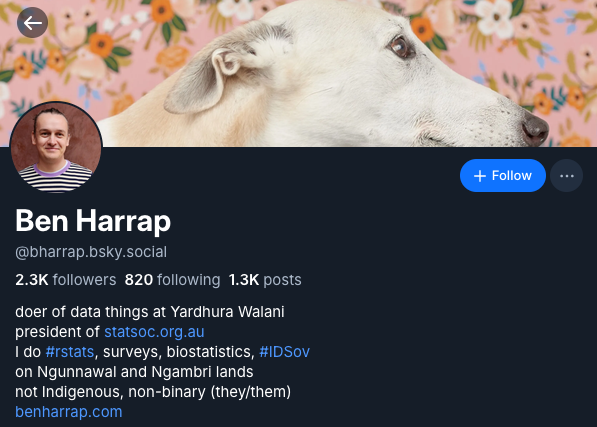
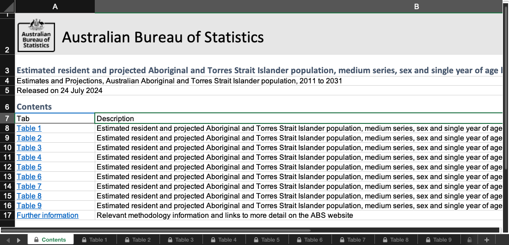
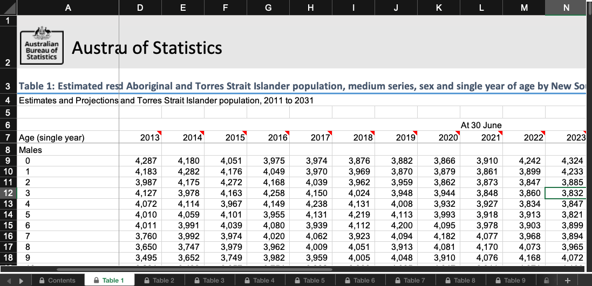
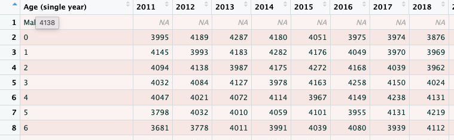
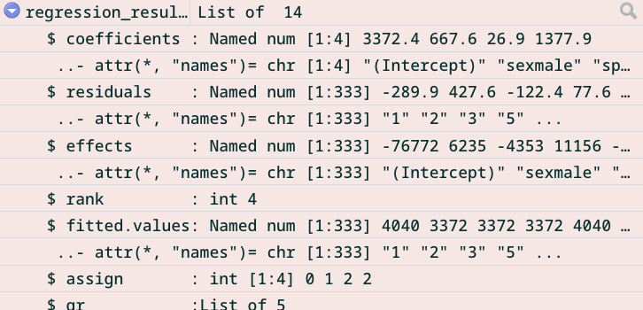

# Hello

```{r}
#| echo: false
library(countdown)
countdown_style(
  box_shadow = "0px 0px 0px 0px #FFFFFF",
  color_background = "#FFFFFF",
  color_running_background = "#FFFFFF",
  color_running_border = "#FFFFFF",
  color_finished_background = "#FFFFFF",
  color_finished_border = "#FFFFFF",
  color_border = "#FFFFFF",
  font_size = "3em"
)
```

## Hello

:::: {.columns}
::: {.column}

:::
::: {.column}


:::
::::

## Outline

::::: {.columns}
:::: {.column width=45%}

::: {.fragment}
-   Getting setup (30min)
    -   RStudio interface
    -   Packages
    -   Projects and folders

:::
::: {.fragment}
-   Coding in R (30min)
    -   Key concepts
    -   Data types
    -   Good practices
    -   Error messages

:::
::::
:::: {.column width=45%}
::: {.fragment}
-   Data wrangling (60min)
    -   Common transformations
    -   Summaries

:::
::: {.fragment}
-   Data visualisation (15min)
    -   `ggplot2`

-   Modelling (15min)
    -   Important notes
    -   Fitting a model
    -   Getting results
    
:::
::::
::::
## What you'll come away with

::: {.incremental}
-   A better understanding of the R ecosystem
-   Code examples
-   More questions
-   The knowledge to figure out how to answer them

:::

## Housekeeping

-   Toilets
-   Breaks
-   Please ask questions
-   I use they/them pronouns

General format will be

- Concept
- Explanation
- Practice

::: {.callout-tip}
These boxes will have links to more information
:::

# Getting started

## R vs. RStudio

R is the language that the code is written in.

RStudio is the interface (GUI) many people use to write R code in.

## Source

:::: {.columns}
::: {.column width="50%"}

The source is where you:

- Edit files
- View data and other objects
- Run scripts from

:::
::: {.column width="50%"}


:::
::::

## Environment

:::: {.columns}
::: {.column width="50%"}

The environment refers to the current state of your R session

This can include:

- packages
- objects (data, plots, etc.)
- functions
- values

:::
::: {.column width="50%"}


:::
::::

## Console

:::: {.columns}
::: {.column width="50%"}
The console is where:

- Output from functions are returned
- Code can be run directly

:::
::: {.column width="50%"}


:::
::::

## Output

:::: {.columns}
::: {.column width="50%"}
The output pane is where:

- R displays your file directory
- Plots will appear if you view them
- Installed packages and help files are shown

:::
::: {.column width="50%"}


:::
::::


## `.RProj` files

:::: {.columns}
::: {.column width="50%"}
Handy files that:

- Set the working directory
- Let you quickly switch between projects

:::
::: {.column width="50%"}


:::
::::

## Working directory

:::: {.columns}
::: {.column}
Reproducible workflows start with good file management:

- Folders to organise your files
- Descriptive names for files and folders
- RProj files set the working directory

:::
::: {.column }
```
/2026-08-27-data-quality
  2026-08-27-data-quality.RProj
  data_quality_report.docx
  /code
    cleaning.R
    descriptives.R
    modelling.R
    visualisation.R
```
```
  /data
    wave_1.csv
    wave_2.csv
  /documentation
    data_analysis_plan.docx
    data_dictionary.csv
  /output
    model_summary.csv
    forest_plot.png
```
:::
::::

## Absolute vs. relative locations

::::: {.columns}
:::: {.column}
::: {.fragment}
Absolute file path for the `cleaning.R` script:

`//Volumes/shared drive/research/mayi kuwayu/wave 2/projects/2026-08-27-data-quality/code/cleaning.R`
:::
::: {.fragment}

Relative file is relative to the current working directory:

`code/cleaning.R`
:::
::::
:::: {.column}
```
/2026-08-27-data-quality
  2026-08-27-data-quality.RProj
  data_quality_report.docx
  /code
    cleaning.R
    descriptives.R
    modelling.R
    visualisation.R
```
```
  /data
    wave_1.csv
    wave_2.csv
  /documentation
    data_analysis_plan.docx
    data_dictionary.csv
  /output
    model_summary.csv
    forest_plot.png
```
::::
:::::

## Specifying relative locations

::::: {.columns}
:::: {.column}
::: {.fragment}
Have to provide directions to find the data:

- `..` means up one folder up
  - `../` is the same as `mayi kuwayu/projects/`

:::

::: {.fragment}
- `../../` means two folders up
  - `../../` is the same as `mayi kuwayu/wave 2`
  - `../../data/w2_v1.csv`
  
:::
::::
:::: {.column}
```
/mayi kuwayu
  /data
    w2_v1.csv
  /projects
    /2026-08-27-data-quality
      2026-08-27-data-quality.RProj
      data_quality_report.docx
      /code
        cleaning.R
        descriptives.R
```
```
        modelling.R
        visualisation.R
      /documentation
        data_analysis_plan.docx
        data_dictionary.csv
      /output
        model_summary.csv
        forest_plot.png
```
::::
:::::

## Packages

<!-- One of the greatest strengths of R is that it is open-source and there are an enormous number of packages available. -->

A package is a collection of functions usually written around a particular goal or task.

::: {.fragment}
To install a package, use the `install.packages` function
```{r}
#| eval: false
install.packages("tidyverse")
```

:::
::: {.fragment}
You then have to load the package using `library()`

```{r}
library(tidyverse)
```

:::

::: {.callout-tip}
For a list of available packages see <https://cran.r-project.org/web/packages/available_packages_by_name.html>
:::

## The `tidyverse`

A set of user-friendly tools for data manipulation and analysis

:::: {.columns}
::: {.column width="60%"}

- Reading in data (`readr`)
- Data cleaning and manipulation (`dplyr`, `tidyr`)
- Data visualisation (`ggplot2`)
- Working with specific data types:
  - Strings (`stringr`)
  - Dates (`lubridate`)
  - Factors (`forcats`)

:::
::: {.column width="40%"}

:::
::::

:::{.callout-tip}
See <https://tidyverse.org/packages/> for details on what's included in the `tidyverse`
:::

## Package conflicts

When you load packages that have the same function name, only one will take precedence

```{r}
#| message: true
library(MASS)
```

:::: {.fragment}
Prevent hours of debugging by being declarative!
::::

:::: {.fragment}
::: {.panel-tabset}

### Inline solution

One option is to use two colons `::` to declare the package as well as the function

```{r}
#| eval: false
data |> 
  dplyr::select()
```

### Package solution

The other option is to use the `conflicted` package and declare preferences upfront

```{r}
library(conflicted)
conflicts_prefer(
  dplyr::select,
  dplyr::filter
  )
```

:::
::::

# Question time

## Let's practice!

::::: {.columns}
:::: {.column width="65%"}

```{r}
#| eval: false
#| code-fold: true
#| code-summary: "Install the `tidyverse` package"
install.packages("tidyverse")
```

```{r}
#| eval: false
#| code-fold: true
#| code-summary: "Load the `tidyverse` package"
library(tidyverse)
```

```{r}
#| eval: false
#| code-fold: true
#| code-summary: "Install the `conflicted` and `MASS` packages"
install.packages(c("conflicted", "MASS"))
```

```{r}
#| eval: false
#| code-fold: true
#| code-summary: "Load the `MASS` library to see the conflict warning"
library(MASS)
```

```{r}
#| eval: false
#| code-fold: true
#| code-summary: "Load the `conflicted` library and set the preferred package for `select`"
library(conflicted)
conflicts_prefer(dplyr::select)
```

::::
:::: {.column width="35%"}
```{r}
#| echo: false
countdown(
  minutes = 5,
  seconds = 0,
  class = c("inline", "no-controls"),
  start_immediately = TRUE
  )
```

::::
:::::

# Coding in R

## Comments

::::: {.columns}
:::: {.column}
::: {.fragment}
```{r}
#| eval: false

#### This is a bookmark ####
# This is a comment, below is code
data |>
  select(species, island)
```
Use comments explain context, intention, functionality etc.
:::
::: {.fragment}

Use bookmarks to navigate sections of code

```
#### Level 1 ####

##### Level 2 ######

###### Level 3 ######
```

:::
::::
:::: {.column}
::: {.fragment}
{style="padding-left:10px;"}
:::
::::
:::::

## Elements of code

There are different terms for different elements of code

```{r}
#| eval: false
data |>
  select(
    species,
    island
  )
```

:::: {.fragment}
In the above code:

::: {.incremental}
- `data` is an object
- `select` is a function
- `species` and `island` are arguments of the `select` function
:::
::::

## Assignment (`<-`)

R prints results in the console by default

::: {.fragment}
```{r}
#| output: true
library(haven)
read_dta("data/auto.dta")
```

:::

::: {.fragment}
Assign results using `<-` to store in an object

```{r}
data <- read_dta("data/auto.dta")
```
:::

## Pipes (`|>`)

Chain sequences of functions together using pipes

::: {.fragment}

```{r}
#| eval: false
data <- read_csv("some_file.csv")
data <- filter(data, age < 5)
data <- mutate(data,
               age_months = age * 12)
summarise(data, mean_age = mean(age_months))
```
:::

::: {.fragment}
They effectively fill in the first argument of a function:

```{r}
#| eval: false
data <- read_csv("some_file.csv")
data |>
  filter(age < 5) |>
  mutate(age_months = age * 12) |>
  summarise(mean_age = mean(age_months))
```
:::

## Data types

Common data types:

- Numbers and integers
- Logicals
- Factors
- Dates/times
- Characters
- Missing

## Numbers

::: {.fragment}
```{r}
class(100)
```
::: 

::: {.fragment}
```{r}
a_number <- 100
class(a_number)
```
:::

::: {.fragment}
```{r}
100 + 1
```
:::

::: {.fragment}
```{r}
a_number + 1
```
:::

## Characters AKA strings

Displayed using single (`''`) or double quotes (`""`)

::: {.fragment}
```{r}
class("100")
```
::: 

::: {.fragment}
```{r}
a_character <- "100"
class(a_character)
```
:::

::: {.fragment}
```{r}
#| error: true
a_character + 1
```
:::

::: {.fragment}
```{r}
as.numeric(a_character) + 1
```
:::

## Logicals

::::: {.cols}
:::: {.column width="45%"}

`TRUE` and `FALSE`

::: {.fragment}
```{r}
class(TRUE)
```
:::
::: {.fragment}
```{r}
class(T)
```
:::
::: {.fragment}
```{r}
class(FALSE)
```
:::
::: {.fragment}
```{r}
class("FALSE")
```
:::

::::
:::: {.column width="10%"}

::::
:::: {.column width="45%"}
::: {.fragment}
Results of comparisons are logicals
```{r}
1 + 1 == 2
```
:::
::: {.fragment}
```{r}
class(1 + 1 == 2)
```
:::

::: {.fragment}
You can treat logicals as numbers!

```{r}
TRUE + TRUE + TRUE
```
:::
::: {.fragment}
```{r}
(1 + 1) * FALSE
```
:::
::::
:::::

## Factors

If we start off with a character vector `animals`

```{r}
animals <- c("bilby", "possum", "echidna")
class(animals)
```

:::: {.fragment}
We can convert it to a factor using `factor()`

::: {.panel-tabset}
### Without specifying levels

```{r}
animals_unspecified <- factor(animals)
class(animals_unspecified)
animals_unspecified
```

### With specifying levels

```{r}
animals_specified <- factor(animals, levels = c("bilby", "possum", "echidna"))
class(animals_specified)
animals_specified
```
:::
::::

## Dates/times

ISO 8601 format `YYYY-MM-DD` is the most straightforward

```{r}
as.Date("2024-01-01")
```

Other formats need to be specified

```{r}
as.Date("01-01-2024")
```

```{r}
as.Date("01-01-2024", tryFormats = "%d-%m-%Y")
```

Be wary of timezones — the default is your system settings

```{r}
as.POSIXct("2024-01-01")
```

```{r}
as.POSIXct("2024-01-01") == as.POSIXct("2024-01-01", tz = "UTC")
```

## Missing

Missing has its own special identity in R — `NA`

::: {.fragment}
It also has its own special function to check if something is missing:

```{r}
animals <- c(animals, NA)
animals
is.na(animals)
```
:::

::: {.fragment}
Be sure to use `is.na()`, if you just use the equals operator it won't work:

```{r}
animals == NA
```
:::

## Vectors and lists

Combining things together

::: {.fragment}
```{r}
a_vector_of_numbers <- c(12351,234576,61534)
class(a_vector_of_numbers)
```
:::
::: {.fragment}
```{r}
a_list_of_numbers <- list(12351,234576,61534)
class(a_list_of_numbers)
```
:::
::: {.fragment}
```{r}
a_tibble_with_numbers <- tibble(numbers = c(12356,23457,35467))
class(a_tibble_with_numbers)
class(a_tibble_with_numbers$numbers)
```
:::

## Data frames and tibbles

## Human-readable code

::: {.panel-tabset}
### Example
```{r}
#| eval: false
data |> mutate(lwr=length/weight)
```

### Space
```{r}
#| eval: false
data |> mutate(lwr = length / weight)
```

### Lines
```{r}
#| eval: false
data |> 
  mutate(
    lwr = length / weight
  )
```

### Naming
```{r}
#| eval: false
data |> 
  mutate(
    length_weight_ratio = length / weight
  )
```

### Comments
```{r}
#| eval: false
data |> 
  mutate(
    # Calculate ratio of length to weight
    length_weight_ratio = length / weight
  )
```

### Bookmarks
```{r}
#| eval: false
#### Cleaning ####
data |> 
  mutate(
    # Calculate ratio of length to weight
    length_weight_ratio = length / weight
  )

#### Plots ####
ggplot(
  ⋮
```
:::


::: {.callout-tip}
Formatters like `air` do a lot of the work for you <https://tidyverse.org/blog/2025/02/air/>
:::

## Common errors

::: {.panel-tabset}
### Trailing comma
```{r}
#| error: true
animals <- c(
  "bilby",
  "echidna",
  "possum",
)
```

### Missing comma
```{r}
#| error: true
animals <- c(
  "bilby"
  "echidna"
  "possum"
)
```

### Equals signs
```{r}
#| error: true
data |>
  mutate(
    price_equals_weight = if_else(
      condition = price = weight,
      true = 1,
      false = 0
    )
  )
```

### Open bracket
```{r}
#| error: true
data |> 
  mutate(
    price_equals_weight = if_else(
      price = weight,
      true = 1,
      false = 0
    )

ggplot(data)
```

### Too many brackets
```{r}
#| error: true
data |> 
  mutate(
    price_equals_weight = if_else(
      price = weight,
      true = 1,
      false = 0
    )
  )
)
```
:::

## Error messages

They try to tell you what the problem was, but it's not always easy

1. Read the error message
1. Look at your code
2. Read help files
3. Check for cheatsheets
4. Web search
5. Join a community
6. Ask an LLM

Try to figure out the solution yourself before consulting an LLM, you'll learn more!

::: {.callout-tip}
You'll get lots of error messages as you learn how to code, this is normal
:::

## Help files

Documentation explaining how a function works:

- Description
- Arguments
- Examples

Run `?filter` from the console, or search the 'Help' pane

## Let's practice!

What might these error messages mean?

::: {.panel-tabset}
### 1

```{r}
#| error: true
bilby
```

### 2

```{r}
#| error: true
library(bilby)
```

### 3

```{r}
#| error: true
1 + "2"
```

### 4

```{r}
#| error: true
animals <- c("bilby","echidna","possum",)
```

### 5

```{r}
#| error: true
animals <- c("bilby","echidna","possum", dingo)
```

:::

# Question time

```{r}
#| echo: false
countdown(
  minutes = 5,
  seconds = 0,
  class = c("inline", "no-controls"),
  start_immediately = TRUE
  )
```

# Break time!

```{r}
#| echo: false
countdown(
  minutes = 15,
  seconds = 0,
  class = c("inline", "no-controls"),
  start_immediately = TRUE
  )
```

# Data wrangling

## Reading in data

Which package to use?

::: {.incremental}
- `readr` for reading `.csv` files
- `googlesheets4` for reading directly from Google Sheets
- `readxl` for Excel files (`.xls` and `.xlsx`)
- `haven` for Stata, SPSS, and SAS files

:::

::: {.callout-tip}
`readr` has [a cheatsheet](https://github.com/rstudio/cheatsheets/blob/main/data-import.pdf)
:::

## Reading in data

If the data are clean, it's not complicated

:::: {.columns}
::: {.column}
```{r}
library(haven)
data <- read_dta("data/auto.dta")
```
:::
::: {.column}
```{r}
#| eval: false
# Function arguments
read_dta(
  file,
  encoding = NULL,
  col_select = NULL,
  skip = 0,
  n_max = Inf,
  .name_repair = "unique"
)
```
:::
::::

## Reading in messy data

Data aren't always machine-readable, especially from the ABS

::: {.panel-tabset}
### First sheet


### Actual data


:::

## Reading in messy data

:::::: {.columns}
::::: {.column}
:::: {.r-stack}
```{r}
#| eval: false
library(readxl)

data <- read_excel(
  "data/32380DO004_20112031.xlsx",
  
  
)
```
::: {.fragment}
```{r}
#| eval: false
library(readxl)

data <- read_excel(
  "data/32380DO004_20112031.xlsx",
  sheet = "Table 1",
  
)
```
:::
::: {.fragment}
```{r}
library(readxl)

data <- read_excel(
  "data/32380DO004_20112031.xlsx",
  sheet = "Table 1",
  skip = 6
)
```
:::
::::
:::::
::::: {.column}
```
read_excel(
  path,
  sheet = NULL,
  range = NULL,
  col_names = TRUE,
  col_types = NULL,
  na = "",
  trim_ws = TRUE,
  skip = 0,
  n_max = Inf,
  guess_max = min(1000, n_max),
  progress = readxl_progress(),
  .name_repair = "unique"
)
```
:::::
::::::

## Viewing data

::::: {.columns}
:::: {.column width="40%"}
Look at your data!

- `View()` or click on the object
- type the name in the console (`data`)
- use `head()` to see a snapshot
- use `dplyr::glimpse()`

::::
:::: {.column width="60%"}
::: {.panel-tabset}
### View


### print

```{r}
data
```

### `head`

```{r}
head(data)
```

### `glimpse`

```{r}
glimpse(data)
```

:::
::::
:::::

## Renaming

`janitor::clean_names()` is a starting point

`dplyr::rename()` and `dplyr::rename_with()` let you specify names

::::: {.panel-tabset}

### Current names

:::: {.columns}
::: {.column width="60%"}
```{r}
names(data)
```
:::
::: {.column width="40%"}

:::
::::

### `clean_names`

:::: {.columns}
::: {.column width="60%"}
```{r}
library(janitor)
data |> 
  clean_names() |> 
  names()
```
:::
::: {.column width="40%"}
```{r}
#| eval: false
# Function arguments
clean_names(
  dat, 
  ...
  )
```
:::
::::

### `rename`

:::: {.columns}
::: {.column width="60%"}
```{r}
data |> 
  rename(
    age = `Age (single year)`
  ) |> 
  names()
```
:::
::: {.column width="40%"}
```{r}
#| eval: false
# Function arguments
rename(
  .data, 
  ...
)
```
:::
::::

### `rename_with`

:::: {.columns}
::: {.column width="60%"}
```{r}
data |> 
  rename_with(
    \(x)
    paste0("y", x),
    `2011`:`2031`
  ) |> 
  names()

```
:::
::: {.column width="40%"}
```{r}
#| eval: false
# Function arguments
rename_with(
  .data,
  .fn,
  .cols = everything(),
  ...
)
```
:::
::::

### Example

:::: {.columns}
::: {.column width="60%"}
```{r}
data <- data |> 
  clean_names() |> 
  rename(
    age = age_single_year
  )
names(data)
```
:::
::: {.column width="40%"}

:::
::::
:::::

## Selecting

Keep or remove columns using `select()`

::::: {.panel-tabset}
### Keep

:::: {.columns}
::: {.column width="60%"}
```{r}
data |> 
  select(age, x2011) |> 
  names()
```
:::
::: {.column width="40%"}
Separate names using commas `,`
:::
::::

### Drop

:::: {.columns}
::: {.column width="60%"}
```{r}
data |> 
  select(-age) |> 
  names()
```
:::
::: {.column width="40%"}
Use a minus `-` to drop a variable
:::
::::

### Ranges

:::: {.columns}
::: {.column width="60%"}
```{r}
data |> 
  select(age, x2011:x2016) |> 
  names()
```
:::
::: {.column width="40%"}
Use a colon `:` connecting two variables to select them and everything in between
:::
::::

### Selectors

:::: {.columns}
::: {.column width="60%"}
```{r}
data |> 
  select(
    contains("202"),
    starts_with("x"),
    where(is.numeric)
  ) |> 
  names()
```
:::
::: {.column width="40%"}
- `contains` matches against a pattern
- `starts_with` only looks at the start
- `where` keeps columns that meet a criteria
- See the `tidyselect` package
:::
::::

### Example

:::: {.columns}
::: {.column width="60%"}
```{r}
data <- data |> 
  select(
    age,
    contains("202")
  )

data
```
:::
::: {.column width="40%"}
- We've kept the `age` variable and counts for the 2020s
:::
::::
:::::

## Filtering

Keep or remove rows using `dplyr::filter()`

::::: {.panel-tabset}

### One

:::: {.columns}
::: {.column width="60%"}
```{r}
data |> 
  filter(age == "18") |> 
  nrow()
```
:::
::: {.column width="40%"}
- `age` is a character
- `==` is how to specify an equality

:::
::::
### Two

:::: {.columns}
::: {.column width="60%"}
```{r}
data |> 
  filter(
    age == "18",
    x2020 > 1000
    ) |> 
  nrow()

data |> 
  filter(
    age == "18" &
      x2020 > 1000
    ) |> 
  nrow()
```
:::
::: {.column width="40%"}
- `x2011` is a number
- Separating conditions with a comma is the same as using `&`

:::
::::
### OR

:::: {.columns}
::: {.column width="60%"}
```{r}
data |> 
  filter(
    age == "18" |
      age == "19"
    ) |> 
  nrow()
```
:::
::: {.column width="40%"}
- The vertical bar `|` is how to specify OR
- If either condition is true, the row is kept

:::
::::
### `%in%`

:::: {.columns}
::: {.column width="60%"}
```{r}
data |> 
  filter(
    age %in% c("18","19","20")
    ) |> 
  nrow()
```
:::
::: {.column width="40%"}

:::
::::
### Example

:::: {.columns}
::: {.column width="60%"}
```{r}
data <- data |> 
  filter(
    between(as.numeric(age), 18, 40) | 
      age %in% c("Males", "Females")
    ) 

data
```
:::
::: {.column width="40%"}
- We've kept only ages 18 to 40, or where age is `Males` or `Females`
:::
::::
:::::

## Modifying

Update an existing column or make a new one using `mutate()`

::::: {.panel-tabset}

### One variable

:::: {.columns}
::: {.column width="60%"}
```{r}
#| output: false
data |> 
  mutate(
    var_1 = "1"
  )
```
:::
::: {.column width="40%"}
- Single equals `=` to specify what the variable (`var_1`) should be

:::
::::

### Multiple variables

:::: {.columns}
::: {.column width="60%"}
```{r}
#| output: false
data |> 
  mutate(
    var_1 = "1",
    var_2 = 2,
    var_3 = as.numeric(var_1) + var_2
  )
```
:::
::: {.column width="40%"}
- Separate variables using commas `,`
- Creating a variable on an earlier line means you can refer to it within the same `mutate()`
:::
::::

### `if_else`

:::: {.columns}
::: {.column width="60%"}
```{r}
#| output: false
data |> 
  mutate(
    var_1 = if_else(
      condition = age %in% c("18", "19", "20"),
      true = 1,
      false = 0,
      missing = 0
    )
  )
```
:::
::: {.column width="40%"}
- `missing` specifies what to do if the value is `NA`
:::
::::

### `case_when`

:::: {.columns}
::: {.column width="60%"}
```{r}
#| output: false
data |> 
  mutate(
    age = as.numeric(age),
    var_1 = case_when(
      age %in% c(18, 19, 20) ~ "18 to 20",
      between(age, 21, 30) ~ "21 to 30",
      between(age, 30, 40) ~ "30 to 40",
      .default = "Other"
    )
  )
```
:::
::: {.column width="40%"}
- `case_when` is from the `dplyr` package
- the condition (left-side) must evaluate to TRUE or FALSE
- the value to assign if this condition is true (right-side)
- separated by a tilde `~`
- the `.default` is `NA` if you don't specify anything
- applies conditions from top to bottom
:::
::::

### Example

:::: {.columns}
::: {.column width="60%"}
```{r}
data <- data |> 
  mutate(
    sex = case_when(
      age == "Males" ~ age,
      age == "Females" ~ age,
      .default = NA
    ),
    age = as.numeric(age),
    age_group = case_when(
      between(age, 18, 24) ~ "18 to 24",
      between(age, 25, 40) ~ "25 to 40"
    )
  )
```
:::
::: {.column width="40%"}
- `sex` is extracted from the `age` variable
- `age` is numeric now
- `age_group` is based on age ranges
:::
::::

:::::

## Filling in missing data

`dplyr::fill()` fills in missing data using the last non-missing values

:::: {.columns}
::: {.column width="60%"}
```{r}
data <- data |> 
  fill(sex, .direction = "down")

data
```
:::
::: {.column width="40%"}
```{r}
#| eval: false
# Function arguments
fill(
  data, 
  ..., 
  .by = NULL, 
  .direction = c("down", "up", "downup", "updown")
)
```

:::
::::

## Reshaping data

`dplyr::fill()` fills in missing data using the last non-missing values

::::: {.panel-tabset}
### Longer
:::: {.columns}
::: {.column width="60%"}
```{r}
data <- data |> 
  filter(!is.na(age)) |> 
  pivot_longer(
    cols = starts_with("x"),
    names_to = "year",
    values_to = "count",
  )

data
```
:::
::: {.column width="40%"}
```{r}
#| eval: false
# Function arguments
pivot_longer(
  data,
  cols,
  ...,
  cols_vary = "fastest",
  names_to = "name",
  names_prefix = NULL,
  names_sep = NULL,
  names_pattern = NULL,
  names_ptypes = NULL,
  names_transform = NULL,
  names_repair = "check_unique",
  values_to = "value",
  values_drop_na = FALSE,
  values_ptypes = NULL,
  values_transform = NULL
)
```

:::
::::
### Wider
:::: {.columns}
::: {.column width="60%"}
```{r}
data <- data |> 
  filter(!is.na(age)) |> 
  pivot_wider(
    names_from = sex,
    values_from = count,
  )

data
```
:::
::: {.column width="40%"}
```{r}
#| eval: false
# Function arguments
pivot_wider(
  data,
  ...,
  id_cols = NULL,
  id_expand = FALSE,
  names_from = name,
  names_prefix = "",
  names_sep = "_",
  names_glue = NULL,
  names_sort = FALSE,
  names_vary = "fastest",
  names_expand = FALSE,
  names_repair = "check_unique",
  values_from = value,
  values_fill = NULL,
  values_fn = NULL,
  unused_fn = NULL
)
```

:::
::::
:::::

## Summaries

::: {.panel-tabset}
### `summary`

Part of base R

```{r}
summary(data)
```

### `tabyl`

From the `janitor` package

```{r}
tabyl(data, age_group)
```

### `summarise`

From `dplyr`

```{r}
data |> 
  summarise(
    n_males = sum(Males),
    n_females = sum(Females)
  )
```

:::

## Grouping

Use `group_by()` or the `.by = ` argument

::::: {.panel-tabset}

### `group_by()`

:::: {.columns}
::: {.column width="60%"}
```{r}
data |> 
  group_by(age_group) |> 
  summarise(
    n_total = sum(Males) + sum(Females)
  )
```
:::
::: {.column width="40%"}
- When you use `group_by()`, the output remains grouped.
- Use `ungroup()` to remove the grouping
:::
::::

### `.by = `

:::: {.columns}
::: {.column width="60%"}
```{r}
data |> 
  summarise(
    n_total = sum(Males) + sum(Females),
    .by = age_group
  )
```
:::
::: {.column width="40%"}
- `.by` applies the grouping just for that operation, so grouping doesn't persist
- Available for:
  - `filter()` and `filter_out()`
  - `mutate()`
  - `summarise()`
  - `slice()` functions
:::
::::
:::::

# Question time

<!-- ## Let's practice! -->

<!-- Using the dataset `mtcars` -->

<!-- ::::: {.columns} -->
<!-- :::: {.column width="65%"} -->

<!-- ```{r} -->
<!-- #| eval: false -->
<!-- #| code-fold: true -->
<!-- #| code-summary: "Install the `tidyverse` package" -->
<!-- install.packages("tidyverse") -->
<!-- ``` -->

# Break time!

# Data visualisation

## Package options

`plot()` — base R

`ggplot2` — part of the `tidyverse`, highly customisable

`tidyplots` — simpler interface to `ggplot2`

## `ggplot2`


<!-- ## Bar chart -->

<!-- ## Line graph -->

<!-- ## Dot plot -->

# Modelling basics

## `penguins`

A quick look at the `penguins` dataset

:::: {.columns}
::: {.column width="70%"}
```{r}
summary(penguins)

head(penguins)
```
:::
::: {.column width="30%"}

:::
::::

## Model notation

:::: {.columns}
::: {.column width="60%"}
To regress `body_mass` on `sex` and `species`, we write:

```{r}
regression_results <- lm(
  body_mass ~ sex + species,
  data = penguins
)
```

The outcome (`body_mass`) is on the left of the tilde `~`

The covariates are on the right and are separated with a plus `+`
:::
::: {.column width="40%"}

```{r}
#| eval: false
# Function arguments
lm(
  formula, 
  data, 
  subset, 
  weights, 
  na.action,
  method = "qr",
  model = TRUE, 
  x = FALSE, 
  y = FALSE, 
  qr = TRUE,
  singular.ok = TRUE,
  contrasts = NULL,
  offset, 
  ...,
  digits
  )
```

:::
::::


<!-- ## Interaction temrs -->

<!-- Interaction terms can be specified  -->

<!-- `mpg ~ hp + cyl*disp` -->

<!-- or -->

<!-- `mpg ~ hp + cyl:disp` -->

## Model fit

```{r}
plot(regression_results)
```

## Model summary

::: {.fragment}
```{r}
regression_results
```
:::
::: {.fragment}
```{r}
summary(regression_results)
```
:::

## Accessing model results

::::: {.columns}
:::: {.column width="60%"}
```{r}
names(regression_results)
```

&nbsp;

&nbsp;

::: {.panel-tabset}
### Coefficients

```{r}
regression_results$coefficients
```

### Residuals

```{r}
regression_results$residuals
```

### Terms

```{r}
regression_results$terms
```

:::
::::
:::: {.column width="40%"}

::::
:::::


## Available models*

Base R

- Linear `lm()`
- Generalised linear `glm()`
  - Binomial
  - Poisson
  

Packages for common models:

- `lme4`
- `gee`
- `glmm`
- `brms`

# Questions!

<!-- ## Let's practice -->

<!-- 1. Install the X package -->
<!-- 2. Fit a X model, regress Y onto X1 + X2 + X3 -->
<!-- 3. Look at the diagnostic plots -->
<!-- 4. Look at the results -->

## Resources

- https://r4ds.hadley.nz/
- https://adv-r.hadley.nz/index.html
- https://epirhandbook.com/en/